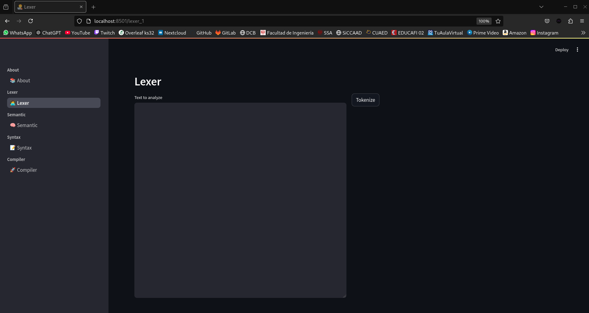
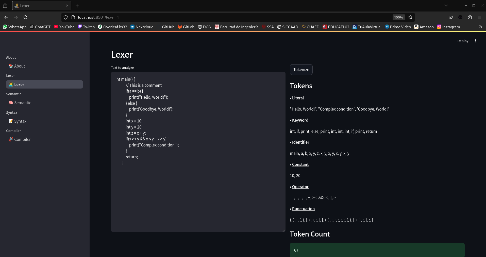

## Introduction

### Problem Formulation

In this project we need to design and implement a lexical analyzer as the first step of building a whole compiler.
The lexical analyser must separate all file in a stream of tokens. Each token most follow a grammatical rule depending on his type, so first the lex has to identify the type of tokens and then save it for the programm output. For this project we design our lex for the C language.

### Motivation

The tokens produced by the lexical analyzer essentialy are the building blocks of our programm. In the next steps of compilation we are going to validate the correct programm structure using these building blocks, so the effectiveness of our compiler will depend directly on the correct work of the lexical analyzer.

### Objectives

Classify each token in the following categories:

<ul>
    <li>Keyword</li>
    <li>Identificator</li>
    <li>Operator</li>
    <li>Constant</li>
    <li>Literal</li>
    <li>Sign punctuation</li>
</ul>
The programm output must show:
<ul>
    <li>Number of tokens</li>
    <li>Each identified token with his clasification</li>
</ul>

## Technologies

We used Python as the main programming language for this project. We also used the following libraries:

<ul>
    <li>re</li>
    <li>unittest</li>
    <li>streamlit</li>
    <li>collections</li>
</ul>

## Theoretical Framework

A **lexeme** is a sequence of characters in the source program that matches the pattern for a token, and is identified by the lexical analyzer as an instance of that token. A **token** is a group of characters that logically belong together as the smallest unit in a compiler. The lexical analyzer groups the characters in the source program into tokens, and passes them to the parser. The parser uses the tokens to construct an abstract syntax tree.

For making the tokenization with essentiately used the **re** library which gives the class re for designing regular expressions and then searching patterns in a text that fulfill those rules.

Essentially, we use some methods form **re** library for the tokenization process, such as:

- .sub(): the functionality we give to this method is to substitute a pattern in a string with another string.

- .findall(): this method returns all the matches of a pattern in a string, returning a list of strings.

- .replace(): this method replaces a string with another.

Internally, the re library implements a finite state machine, this assure the complex time of the search is linear and efficient. Also for doing this, first the regex defined expression are tokenize by the sre_parser.py file. This produces sre(simple regular expresion), which are re expressions without special characters, sequences and symbols. Then the sre_compile.py turns this sre into bytecode and finally the _sre.c file makes the work for the machine.

## Development

### Design Considerations

#### Keywords:

- if
- else
- int
- return
- print

#### Operators:

- \+
- \-
- \*
- /
- =
- ==
- \>\<
- <
- \>
- <=
- \>=
- &&
- ||

#### Constants:

- [0-9]+

#### Identifiers:

- [a-zA-Z][a-zA-Z0-9]*

#### Punctuation:

- (
- )
- {
- }
- ;
- ,

#### Comments:

- //.*

#### Literals:

- ".\*"
- '.\*'

### Implementation

#### Backend

For the implementation, at first we thought of removing all comments from the source code, this was for not dealing with them during the token identification, also to have a hierarchical structure while reading and extracting tokens. Then, we extracted the literals because this could also cause problems with the later token's identification.

After that, we started with the identifier section. For this, we compared the reserved keywords list so it doesn't match and have conflicts with keywords, such as return, int, etc. Then, we started with the constants, operators, and punctuation identification. This part was less conflictive in code unlike the constants and identifiers which we had match problems with the keywords, that's bec .

Finally, the unknown tokens where considered as the rest of the non-alphanumeric characters, excluding spaces and new lines.

#### Frontend

We adapted the project for a web application using streamlit library. We created a simple interface where the user can upload a string input and see the output from the lexical analyzer. Here is an example of the interface:



#### How to run

Once you have installed the required libraries and cloned the repository, you can run the application using the following command:

```bash
$ PYTHONPATH=. streamlit run app/streamlit_app.py
```

## Results

As result we can say that the lexical analyzer works as expected. We have a series of test cases to show the behavior of the program. To run the tests, you can use the following command:

```bash
$ python -m unittest discover -s tests
```
### Expected Output

This is an example of the expected output of the tests

```bash
...
--------------------------------------------------------------------
Ran 3 tests in 0.001s

OK
```
Also there is an example of the output of the web application showing the tokens of the input string classified by it's type and the total number of tokens.



## Conclusions

We think the lexical analyzer is a fundamental part in a compiler, as it is the easiest part to implement, but a correct implementation is essential to avoid problems in the next steps of the compilation process. We do consider all the requierements of the project were met, with some minor issues that were solved during the development, this proves is not as trivial as it seems.

## References
- Streamlit. (n.d.). Streamlit documentation [Online]. Available: https://docs.streamlit.io/

